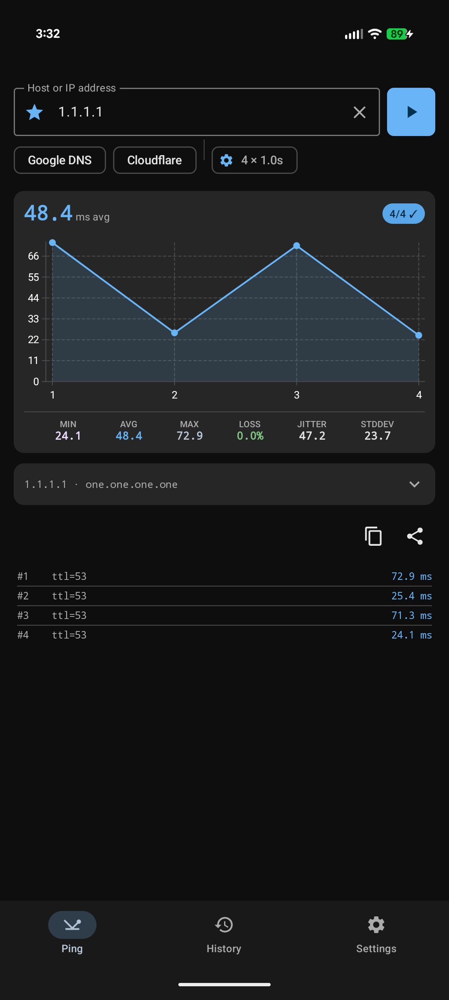
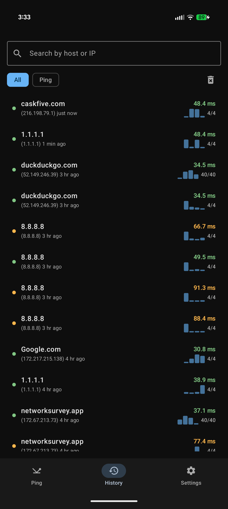
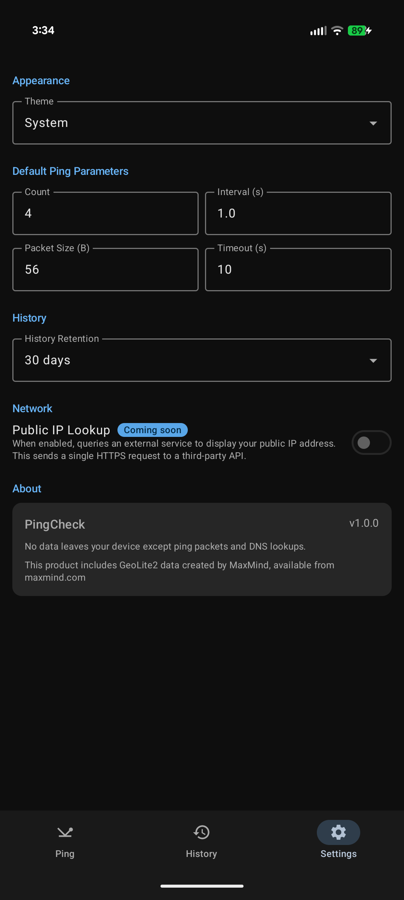

# PingCheck

A simple, privacy-focused Android ping utility. No data leaves your device except ping packets and DNS lookups.

[](https://play.google.com/store/apps/details?id=com.caskfive.pingcheck)

<p align="center">
  
  
  
</p>

## Features

- **Ping** — Execute pings with configurable count, interval, packet size, and timeout
- **Latency Charts** — Visualize ping latency over time with min, avg, max, loss, jitter, and stddev stats
- **Geolocation** — Country, ASN, and org info via bundled MaxMind GeoLite2 databases
- **Favorites** — Save hosts with custom display names and per-host settings
- **History** — Browse and search past ping sessions
- **IPv4 & IPv6** — Automatic protocol detection

## Tech Stack

Kotlin, Jetpack Compose, Material 3, Hilt, Room, Coroutines, Vico (charts), MaxMind DB Reader

## Requirements

- Min SDK 24 (Android 7.0)
- Target SDK 35 (Android 15)
- Java 17

## Building

```sh
./gradlew assembleDebug
```

## License

This project is licensed under the [GNU General Public License v3.0](https://www.gnu.org/licenses/gpl-3.0.en.html).
